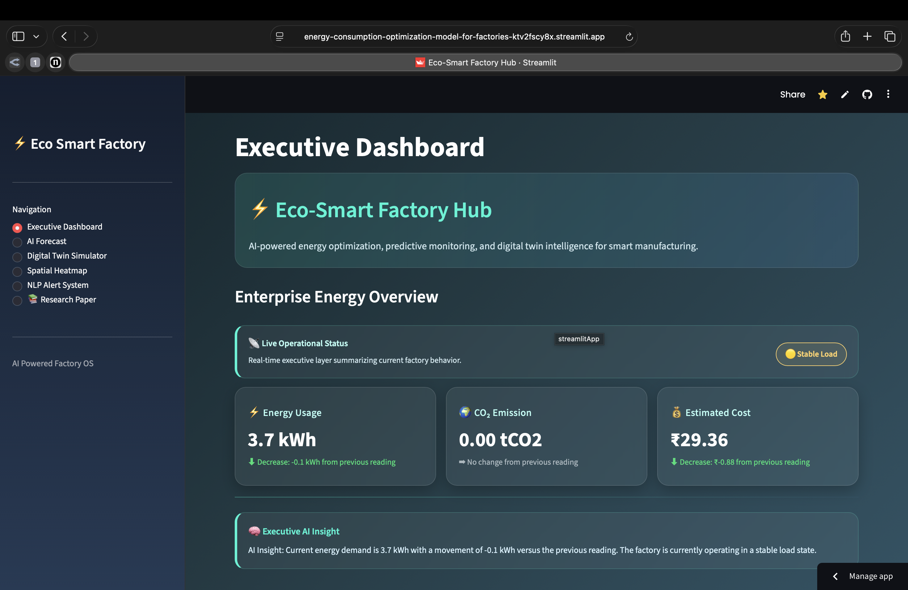
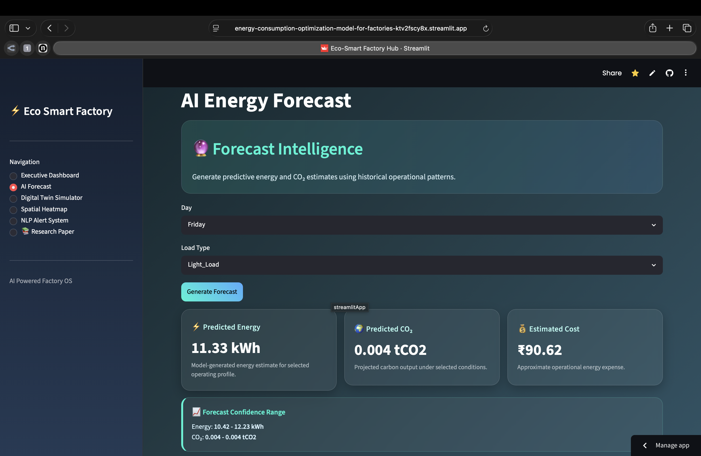
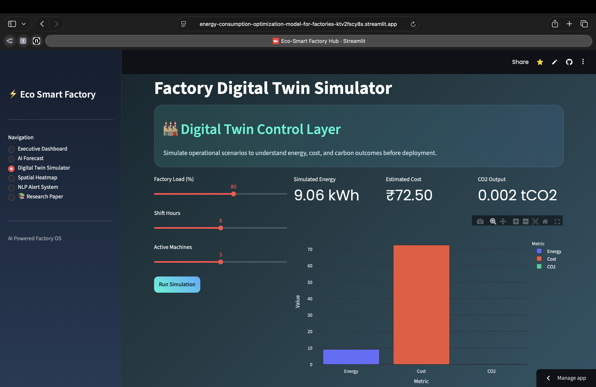
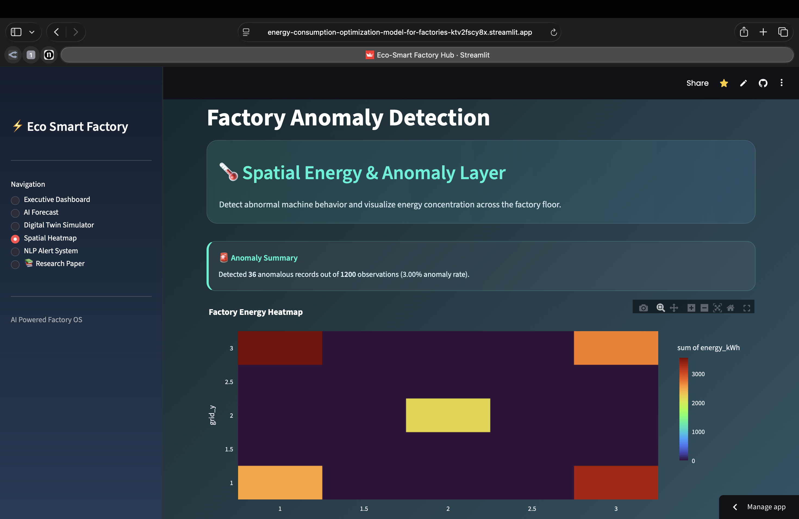
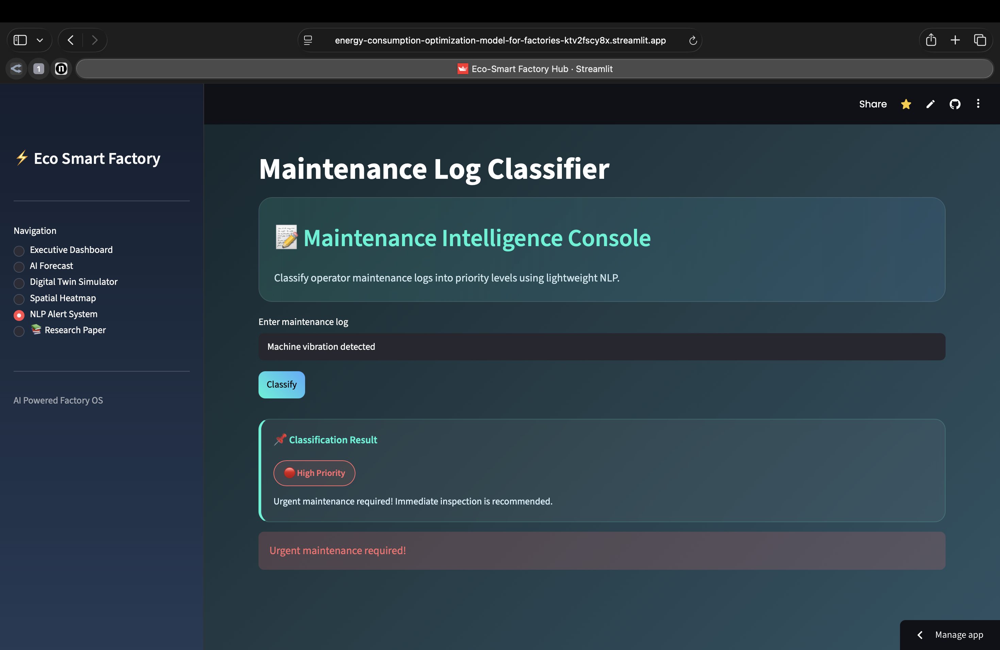
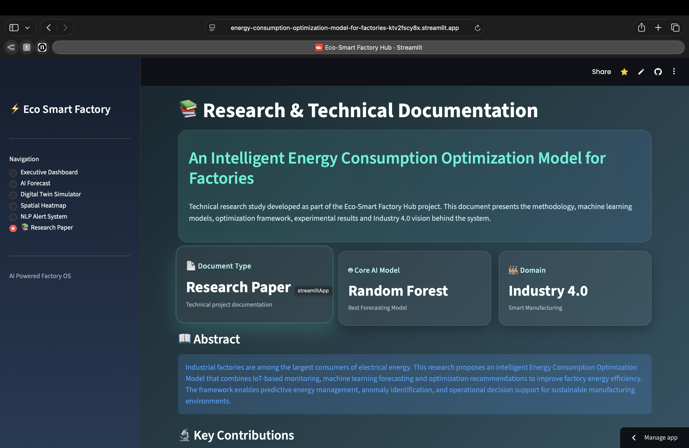

<div align="center">

<br/>

<!-- HERO BADGE -->


<br/><br/>

# ⚡ Eco-Smart Factory Hub

### AI-Based Energy Consumption Optimization Model for Factories

**An intelligent analytics platform that analyzes, predicts, and optimizes industrial energy consumption.**  
Combining machine learning, anomaly detection, digital twin simulation, and NLP-based maintenance intelligence to help factories reduce waste, cut costs, and lower carbon emissions.

<br/>

[](https://energy-consumption-optimization-model-for-factories-ktv2fscy8x.streamlit.app)

<br/>

</div>

---

## 📌 The Problem

Industrial facilities consume vast amounts of electrical energy daily. Without intelligent monitoring, inefficiencies compound silently — driving up costs, emissions, and unexpected downtime.

| ⚡ Excessive Energy Use | 💸 Rising Electricity Costs | ☁️ High Carbon Emissions | 🔧 Unplanned Downtime |
|:---:|:---:|:---:|:---:|
| Machines running beyond demand windows waste power on idle cycles | Poor scheduling inflates peak-hour consumption and billing | Unoptimized operations push CO₂ beyond acceptable thresholds | Undetected anomalies cause equipment failures with no warning |

---

## 🚀 Key Features

### `1` Executive Energy Dashboard
> **Management-level visibility into factory-wide energy performance and cost trends.**

A premium real-time dashboard monitoring enterprise energy metrics with KPI delta tracking and color-coded trend indicators.

- 📊 Live energy usage (kWh) with trend visualization
- 🌿 CO₂ emissions (tCO₂) tracking
- 💰 Estimated electricity cost monitoring
- 📈 KPI delta tracking — increase/decrease vs previous reading

---

### `2` AI Energy Forecasting
> **Predict future energy demand before it happens — not after.**

Uses a **Random Forest Regressor** to forecast energy-related metrics based on operational conditions, enabling proactive planning.

- 🔋 Predicts energy consumption, CO₂ emissions, and estimated cost
- 📅 Inputs: day of the week + load type
- 📉 Forecast confidence ranges for energy and CO₂ outputs

---

### `3` Factory Digital Twin Simulator
> **Test production scenarios virtually before running them on the floor.**

A simplified digital twin that estimates factory performance under different operating conditions — no real-world risk required.

| Parameter | Description |
|---|---|
| Factory load (%) | Simulated operational load level |
| Shift duration (hours) | Duration of the active production shift |
| Active machines | Number of machines running simultaneously |

**Outputs:** Simulated energy · Estimated operating cost · CO₂ output · Energy efficiency score

---

### `4` Machine Anomaly Detection
> **Catch problems before they become failures.**

Runs **Isolation Forest** on IoT sensor data to surface abnormal machine behaviour — identifying faults, overloads, and inefficiencies automatically.

- ⚡ Monitored: Energy (kWh) · Current (A) · Machine utilization (%)
- 🚨 Flags: Energy inefficiency · Faults · Overload conditions · Preventive maintenance needs

---

### `5` NLP Maintenance Log Classifier
> **Stop reading every log. Let the model prioritize for you.**

A lightweight **NLP pipeline** that classifies incoming maintenance logs into actionable priority levels so teams focus on what actually matters.

| Category | Description |
|---|---|
| 🔴 High Priority | Urgent issues requiring immediate attention |
| 🟡 Routine | Scheduled or standard maintenance notes |
| ⚫ Spam / Ignored | Noise, duplicates, and irrelevant messages |

**Model:** CountVectorizer + Multinomial Naive Bayes

---

## 🧠 Machine Learning Models

```
┌─────────────────────────────────────────────────────────────────────┐
│                      ML Architecture Overview                       │
├──────────────────────┬──────────────────────┬───────────────────────┤
│  Random Forest       │  Isolation Forest    │  Multinomial          │
│  Regressor           │                      │  Naive Bayes          │
├──────────────────────┼──────────────────────┼───────────────────────┤
│  Energy forecasting  │  Anomaly detection   │  NLP log              │
│  CO₂ prediction      │  on IoT sensor data  │  classification       │
│  Cost estimation     │  (unsupervised)      │  (text-based)         │
└──────────────────────┴──────────────────────┴───────────────────────┘
```

---

## 🛠️ Tech Stack

| Category | Tools |
|---|---|
| **Language & Framework** | Python · Streamlit |
| **Machine Learning** | Scikit-learn (Random Forest · Isolation Forest · Naive Bayes) |
| **NLP** | CountVectorizer · Multinomial Naive Bayes |
| **Data Processing** | Pandas · NumPy |
| **Visualization** | Plotly Express |

---

## 📂 Datasets

### Dataset 1 — Steel Industry Energy Consumption
Used for:
- AI energy forecasting
- CO₂ emission prediction
- Executive dashboard KPIs

### Dataset 2 — IoT Energy Dataset
Used for:
- IoT sensor-based anomaly detection
- Machine spatial heatmap analysis
- Isolation Forest model training

---

## 📊 System Modules

```
eco-smart-factory-hub/
│
├── 📊  Executive Dashboard       ← Live KPI monitoring
├── 🤖  AI Forecast               ← Random Forest predictions
├── 🔲  Digital Twin Simulator    ← Scenario planning
├── 🗺️  Spatial Heatmap           ← Machine-level anomaly detection
└── 💬  NLP Alert System          ← Maintenance log classification
```

---

## 📸 Screenshots

| Executive Dashboard | AI Forecasting |
|:---:|:---:|
|  |  |

| Digital Twin Simulator | Heatmap & Anomaly Detection |
|:---:|:---:|
|  |  |

| NLP Alert System | Research Paper |
|:---:|:---:|
|  |  |

---

## 🌱 Real-World Impact

```
✅  Reduce unnecessary energy consumption
✅  Improve machine-level operational efficiency
✅  Lower electricity expenditure
✅  Minimize carbon emissions
✅  Detect abnormal equipment behaviour early
✅  Enable data-driven production decisions
```

> **Supports Industry 4.0, ESG carbon reduction monitoring, and sustainable manufacturing initiatives.**

---

## 🎯 Real-World Applications

- 🏭 Smart manufacturing plants
- ⚡ Industrial energy management systems
- 🌿 Sustainable production monitoring
- 📈 Factory operations analytics
- 🔧 Predictive maintenance support systems
- 🌍 ESG / carbon reduction monitoring platforms

---

## 💻 Getting Started

### Prerequisites
- Python 3.8+
- pip

### Installation

**1. Clone the repository**
```bash
git clone https://github.com/your-username/eco-smart-factory-hub.git
cd eco-smart-factory-hub
```

**2. Install dependencies**
```bash
pip install -r requirements.txt
```

**3. Launch the app**
```bash
streamlit run app.py
```

**4. Open in your browser**
```
http://localhost:8501
```

---

## 📁 Project Structure

```
eco-smart-factory-hub/
├── app.py                    # Main Streamlit application
├── requirements.txt          # Python dependencies
├── datasets/
│   ├── steel_industry.csv    # Steel industry energy dataset
│   └── iot_energy.csv        # IoT sensor energy dataset
├── models/
│   ├── forecasting.py        # Random Forest energy forecasting
│   ├── anomaly.py            # Isolation Forest anomaly detection
│   └── nlp_classifier.py     # Naive Bayes log classifier
├── screenshots/
│   ├── Executive_dashboard.png
│   ├── AI_forecast.png
│   ├── Digital_twin_simulator.png
│   ├── heatmap.png
│   ├── NLP_alert_system.png
│   └── Research_paper.png
└── README.md
```

---

<div align="center">

**Built for Industry 4.0 · Sustainable Manufacturing · ESG Carbon Monitoring**

<br/>

[](https://energy-consumption-optimization-model-for-factories-ktv2fscy8x.streamlit.app)

<br/>

*If you found this project useful, consider giving it a ⭐ on GitHub!*

</div>
